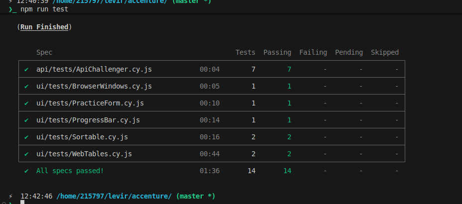
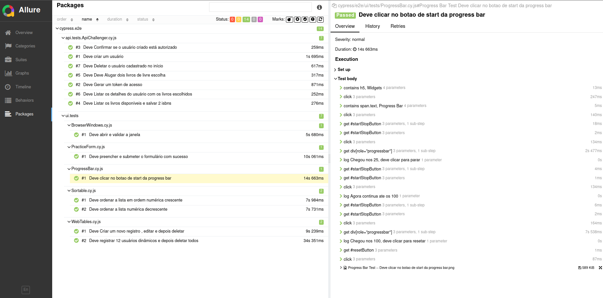

# Developed by Levir Lemos

# Project Tests

This project contains API and UI tests. 

Formatted in UTF-8


## Allure Reports

This project uses Allure to generate test reports.

### Generating the report

To generate and view the Allure report, follow these steps:

1. Install dependences:
    ```bash
    npm i
    ```

1.  Run Cypress tests:
    ```bash
    npm run test
    ```





2.  Command to open Allure report:
    ```bash
    npm run allure
    ```


